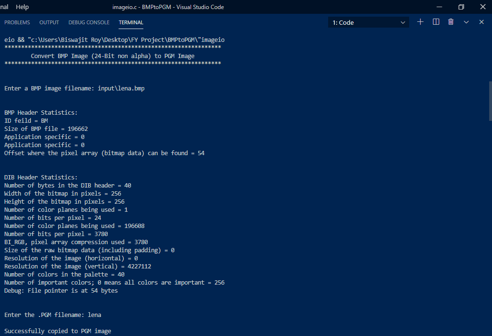

# BMPtoPGM
### Description
Classic C code for converting a `BMP (bitmap image)` image to `PGM (portable graymap)` file format. The code can successfully convert *1-channel, 24-bit bitmap* images to its `.pgm` format.

### Running instructions
Compile the `imageio.c` file using `C` compiler and execute the binary file in terminal.

Sample inputs and outputs are present in `input` and `output` directory respectively.

### Terminal View


### Sample runs
+ Pure 1-Channel, 24-Bit Image

    
    
    

+ 3-Channel, 24-Bit Image

    
    
    

+ Discrepancy with large resolution images

    
    
    

+ Discrepancy with `monochrome bitmap` images

    
    
    

### Note

+ Representations above are made in formats viewable in browsers. Actual images present in `output` directory

+ 3-Channel, 24-Bit Image changes to 1-Channel at `line:87` in `file:imageio.c`. Please make changes accordingly for specific channel output.

    ```
    for red channel: fwrite(&((image+i*width+j)->r),1,sizeof(unsigned char),fp);

    for green channel: fwrite(&((image+i*width+j)->g),1,sizeof(unsigned char),fp);

    for blue channel: fwrite(&((image+i*width+j)->b),1,sizeof(unsigned char),fp);

    ```